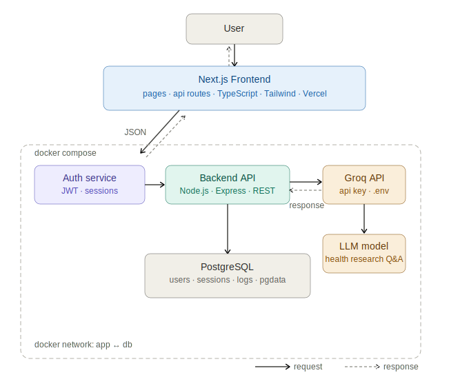

# Health Research AI
Health Research AI is a web app that helps people make sense of symptoms without jumping to conclusions. You sign in, describe what you’re feeling, and get a clear, structured readout: what might be going on, how urgent it feels, what to watch for, and practical next steps. Your checks are saved so you can see patterns over time. It can also suggest nearby doctors and hospitals based on where you are with map links and contact details when available. It’s built to feel calm and informative,not a replacement for a real doctor, but a better starting point than guessing alone.


## Architecture




---

## Groq API

The project uses the [Groq API](https://console.groq.com/) for LLM inference. Groq is selected for its low-latency response times.

- **Model:** `llama3-70b-8192`
- **Use case:** Health research Q&A-the LLM receives the user's question and returns a research-informed response
- **Key management:** API key is loaded from `.env` on the backend and never exposed to the client

Request flow:

```
Client -> Next.js -> Express API -> Groq API (LLM)
                         |
                    PostgreSQL (session + log write)
```

---


---


## Environment Variables

Create `backend/.env`:

```env
# Groq
GROQ_API_KEY=your_groq_api_key_here

# PostgreSQL
POSTGRES_USER=postgres
POSTGRES_PASSWORD=yourpassword
POSTGRES_DB=healthguide
DATABASE_URL=postgresql://postgres:yourpassword@db:5432/healthguide

# Auth
JWT_SECRET=your_jwt_secret

# Server
PORT=5000
NODE_ENV=development
```

## Docker Setup

The backend stack (Express + PostgreSQL) runs via Docker Compose.

```bash
# Start all services
docker-compose up --build

# Stop services
docker-compose down

# Stop and remove volumes (resets database)
docker-compose down -v
```

Services started by `docker-compose up`:

| Service | Description | Port |
|---|---|---|
| `app` | Node.js / Express REST API | `5000` |
| `db` | PostgreSQL 16 with `pgdata` volume | `5432` |

Both services communicate over an internal Docker network (`app <-> db`). The database is not exposed externally in production.

`docker-compose.yml` summary:

```yaml
services:
  app:
    build: ./backend
    ports: ["5000:5000"]
    depends_on: [db]
    env_file: .env

  db:
    image: postgres:16
    volumes:
      - pgdata:/var/lib/postgresql/data
    env_file: .env

volumes:
  pgdata:
```

---

## Database

PostgreSQL stores users, sessions, and conversation logs.

| Table | Description |
|---|---|
| `users` | Registered accounts |
| `sessions` | Active JWT sessions |
| `logs` | Conversation history and LLM responses |

Run migrations inside the app container:

```bash
docker exec -it healthguide_app npm run migrate
```

Or apply SQL directly:

```bash
docker exec -it healthguide_db psql -U postgres -d healthguide -f /migrations/init.sql
```

---

## Frontend

```bash
cd frontend
npm install
npm run dev        # Development server at http://localhost:3000
npm run build      # Production build
npm start          # Serve production build
```

## Backend

```bash
cd backend
npm install
npm run dev        # Development server at http://localhost:5000
```

## Contributing

```bash
git checkout -b feature/your-feature
git commit -m "description of change"
git push origin feature/your-feature
# Open a Pull Request on GitHub
```


